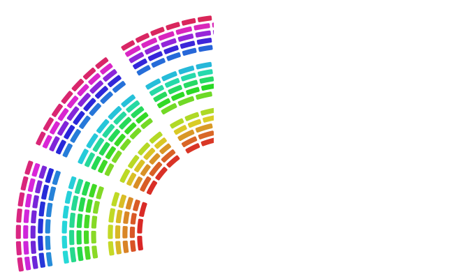

# [hemicycle.dev](https://hemicycle.dev/)



[](https://opensource.org/licenses/MIT)
[](https://nodejs.org/)

A TypeScript package for rendering parliament-style hemicycle seat charts — the fan-shaped seating layouts used to visualize legislative assemblies and voting bodies.

---

## Packages

| Package                                    | Version                                                                                                     | Description                                           |
| ------------------------------------------ | ----------------------------------------------------------------------------------------------------------- | ----------------------------------------------------- |
| [`@hemicycle/core`](./packages/core)       | [](https://www.npmjs.com/package/@hemicycle/core)       | Layout engine — computes seat coordinates and indices |
| [`@hemicycle/vanilla`](./packages/vanilla) | [](https://www.npmjs.com/package/@hemicycle/vanilla) | Framework-free SVG renderer                           |
| [`@hemicycle/react`](./packages/react)     | [](https://www.npmjs.com/package/@hemicycle/react)     | React `<Hemicycle />` component                       |

Pick the package that matches your stack. They build on each other — `vanilla` wraps `core`, and `react` wraps `vanilla` — so you only need to install one.

---

## Getting Started

### React

```bash
npm install @hemicycle/react
```

```tsx
import { Hemicycle } from "@hemicycle/react";

<Hemicycle
  rows={7}
  totalSeats={577}
  data={members.map((m) => ({
    idx: m.seatNumber,
    seatConfig: { color: m.partyColor },
  }))}
/>;
```

### Vanilla JS / any framework

```bash
npm install @hemicycle/vanilla
```

```ts
import { Hemicycle } from "@hemicycle/vanilla";

const hemicycle = new Hemicycle({ rows: 7, totalSeats: 577 });
hemicycle.updateData(
  members.map((m) => ({
    idx: m.seatNumber,
    seatConfig: { color: m.partyColor },
  })),
);
hemicycle.render(document.querySelector("svg")!);
```

### Layout only (no rendering)

```bash
npm install @hemicycle/core
```

```ts
import { Hemicycle } from "@hemicycle/core";

const hemicycle = new Hemicycle({ rows: 7, totalSeats: 577 });
const layout = hemicycle.getSeatsLayout();
// layout[i] → { x, y, innerR, outerR, angle1Rad, angle2Rad, ... }
```

---

## Development

This repo uses [Yarn workspaces](https://classic.yarnpkg.com/en/docs/workspaces/) and [Turborepo](https://turbo.build/).

**Prerequisites:** Node.js ≥ 18, Yarn 1.22

```bash
# Install all dependencies
yarn install

# Build all packages
yarn build

# Run tests
yarn test

# Start all packages in watch mode
yarn dev
```

---

## Repo Structure

```
hemicycle/
├── packages/
│   ├── core/       # @hemicycle/core
│   ├── vanilla/    # @hemicycle/vanilla
│   └── react/      # @hemicycle/react
├── apps/
│   ├── docs/       # documentation
│   └── web/        # demo site
├── configs/        # shared tooling configs
└── data/           # shared data packages
```

---

## Author

**Gabriel Vidal** — [gvidalayrinhac@gmail.com](mailto:gvidalayrinhac@gmail.com)

## License

[MIT](LICENSE)
